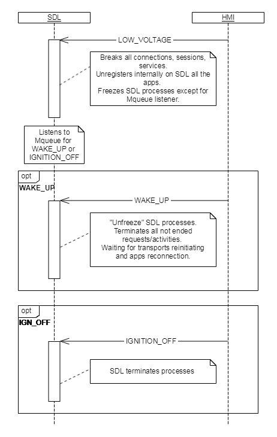

## Low Voltage  

Type
: Signal

Sender
: HMI

Purpose
: To suspend SDL's services due to a low voltage event

### Description  
A 'LowVoltage' event occurs on HMI when battery voltage hits below a certain predefined threshold set by the system.  
 In case of such event, the EMMC is turned off and all read/write operations are unavailable. After the voltage level is restored all operations are resumed.

!!! MUST   

1. Send a "LOW_VOLTAGE" message via mqueue to SDL when 'LowVoltage' event occurs
2. Send a "WAKE_UP" message via mqueue to SDL when the voltage recovers
3. Send a "IGNITION_OFF" message when SDL processes have to be terminated, applications have to be unregistered due to shut the ignition off    

!!!

!!! NOTE 
* SDL ignores all requests from mobile applications without providing any kind of response
* SDL ignores all requests, responses and messages from HMI except messages for "WAKE_UP" or "IGNITION_OFF"  
* All transports are unavailable for SDL
* SDL persists resumption related data stored before receiving a "LOW_VOLTAGE" message  
* SDL resumes its regular work after receiving a "WAKE_UP" message  
* SDL must start up correctly in the next ignition cycle after it was powered off in low voltage state

#### Parameters
**Message queue channel between HMI and SDL**

Mqueue name can be specified in smartdevicelink.ini file:

```
[MAIN] 
; Message queue name used by SDL for handling LOW_VOLTAGE functionality
SDLMessageQueueName = /SDLMQ
```  

**Message queue signals value**  

|Signal name|Value(string)|
|:---|:---| 
|LOW_VOLTAGE|"LOW_VOLTAGE"|
|WAKE_UP|"WAKE_UP"|
|IGNITION_OFF|"IGNITION_OFF"|

### Sequence Diagrams  

|||
Low Voltage  
  
|||
